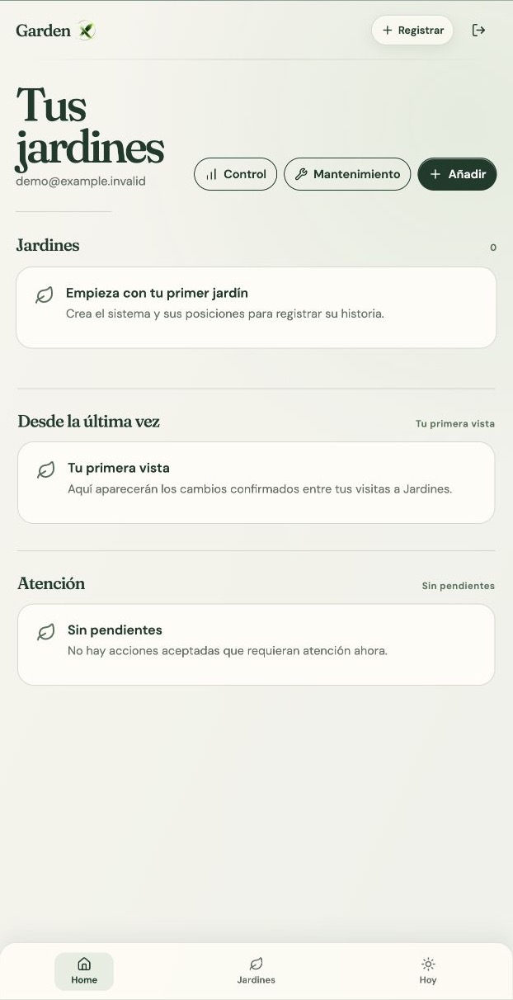
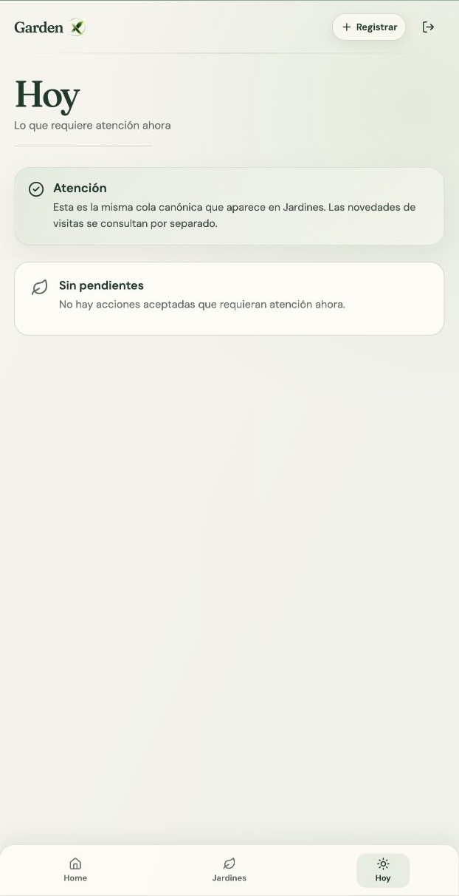
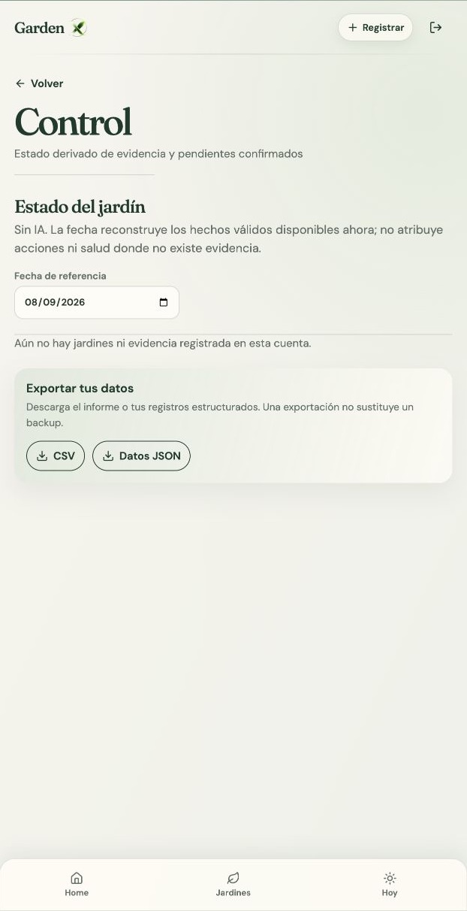

# Streex Garden

Streex Garden es una aplicación privada para registrar, revisar y comprender la historia de jardines físicos y sus ciclos de cultivo.

La propuesta no es convertir el cuidado en una lista genérica de recordatorios. Garden conecta el sistema físico —jardín, posición y elemento técnico— con una línea temporal de hechos confirmados, fotografías documentales y acciones pendientes. Así, cada visita puede responder dos preguntas distintas: qué cambió desde la última vez y qué necesita atención ahora.

> **Estado:** MVP manual implementado. La aplicación incluye autenticación, persistencia en Supabase, fotografías privadas, control operativo, soporte offline acotado y PWA. La integración de IA permanece fuera del producto actual.

## Product Screenshots / Demo

La interfaz está diseñada para móvil, tablet y escritorio, con una dirección visual editorial inspirada en una historia botánica documental.

Las siguientes imágenes muestran una cuenta demo genérica y vacía: no hay jardines, ciclos, fotografías ni tareas cargadas. El correo visible es `demo@example.invalid`, un dominio reservado para ejemplos; no corresponde a una cuenta real.

<table>
  <tr>
    <td align="center"><strong>Home · estado inicial</strong><br></td>
    <td align="center"><strong>Hoy · sin pendientes</strong><br></td>
    <td align="center"><strong>Control · sin evidencia</strong><br></td>
  </tr>
</table>

Las imágenes se prepararon a partir del estado vacío verificado en el arnés visual local. Se incluyen como material de portfolio para mostrar la jerarquía de la interfaz sin exponer información personal, datos de uso ni contenido de una cuenta cargada.

**Demo desplegada:** [garden.getstreex.com](https://garden.getstreex.com) — requiere una cuenta autorizada; no se publican credenciales de prueba en este repositorio.

## El problema

El cuidado de un jardín doméstico o de un sistema de cultivo compacto suele quedar repartido entre memoria, fotografías, mensajes y notas sin contexto. Cuando una planta cambia de posición, se reemplaza o se corrige una fecha, la información anterior puede dejar de ser confiable sin que quede claro por qué.

Garden aborda ese problema con un registro centrado en la procedencia:

- cada observación pertenece a un ciclo y conserva su fecha y contexto;
- una fotografía se trata como evidencia documental, no como decoración;
- los cambios estructurales —cerrar, reemplazar, trasladar o corregir— conservan su auditoría;
- las tareas pendientes se separan de los hechos ya observados;
- las recomendaciones o datos históricos importados no se convierten en hechos sin confirmación explícita.

## Qué es Streex Garden

Streex Garden es un diario operativo y visual privado para personas que mantienen uno o más jardines físicos, especialmente sistemas compactos con posiciones identificables.

El modelo de producto sigue esta jerarquía:

`Garden → Position / elemento físico → Grow Cycle → Evidence / Attention`

La interfaz usa la identidad **Garden X** en algunas superficies visuales, pero el producto y el repositorio se denominan Streex Garden.

## Funcionalidades actuales

### Implementado en código

- **Acceso privado:** inicio de sesión por email y contraseña, sesión persistente, recuperación y actualización de contraseña, y cierre de sesión con limpieza del estado local.
- **Home y jardines:** resumen de jardines propios, cambios confirmados desde la última visita, cola de atención y portada configurable para Home y para cada jardín.
- **Configuración física:** creación de jardines y edición de mapas configurables. Un punto puede representar un espacio de cultivo o un elemento técnico; los números de posición se conservan aunque cambie la configuración.
- **Ciclos de cultivo:** iniciar un ciclo, registrar fecha con precisión explícita, consultar ocupaciones actuales e históricas, cosechar, cerrar, reemplazar/resembrar, trasladar, corregir la siembra, solicitar reapertura e invalidar registros con motivo.
- **Observaciones y fotografías:** registrar una nota, una fotografía o ambas; aceptar JPEG, PNG, HEIC, HEIF y WebP; conservar el original, validar tamaño y calcular su checksum SHA-256 antes de subirlo.
- **Hechos estructurados:** registrar germinación, cantidad de plantas, estado observado, desarrollo, preparación para cosecha, intervenciones e incidencias.
- **Historial visual:** recorrer las fotografías confirmadas de un ciclo, abrir el original en un visor y comparar exactamente dos momentos del mismo ciclo.
- **Atención:** crear seguimientos manuales a nivel de ciclo o jardín, posponerlos, completarlos o descartarlos con una razón. La cola de Hoy y la atención de Home consultan la misma fuente canónica.
- **Control:** consultar una proyección determinista por fecha de referencia con edad, germinación, conteos, aclareo, preparación para cosecha, estado observado y acciones relevantes.
- **Mantenimiento:** iniciar un recorrido sobre uno o varios jardines, revisar u omitir posiciones, pausar, reanudar, completar o abandonar el recorrido conservando lo ya registrado.
- **Importación selectiva:** introducir candidatos históricos como observación, recomendación o contradicción y revisarlos antes de que una observación pueda entrar al historial.
- **Exportación:** descargar los datos del propietario en JSON y el Control en CSV.
- **PWA y resiliencia acotada:** instalación como PWA, aviso de actualización, caché local de la instantánea de Home y borradores de observaciones en IndexedDB con reintento al recuperar la conexión.

### Parcialmente implementado o con alcance acotado

- **Offline:** no es un modo offline completo. Los borradores de observaciones pueden guardarse localmente y sincronizarse después; las acciones estructurales, los hechos estructurados y el mantenimiento requieren conexión.
- **Importación:** existe la cola de revisión y el flujo de confirmación, pero no existe un conector o parser para una fuente externa. El ingreso actual es manual.
- **Mapas:** el editor permite configurar la geometría y los tipos de punto. La documentación del proyecto identifica como mantenimiento pendiente la confirmación física definitiva de orientación y numeración de los sistemas URUQ.
- **Producción:** el repositorio documenta despliegue, backup diario y simulacro de restauración, pero esos documentos no sustituyen una nueva prueba autenticada con una cuenta secundaria o un dispositivo concreto.

### Fuera del alcance actual

- No hay proveedor de IA, gateway de IA, clave de modelo ni llamadas a modelos.
- No hay **AI Check**, **Ask Garden**, chat persistente ni aceptación automática de propuestas.
- No se exponen equipos multiusuario, roles, notificaciones push ni recordatorios externos.
- No existe backend propio ni una API de aplicación separada de Supabase.

## Experiencia principal del usuario

1. La persona inicia sesión y llega a **Home**, donde ve sus jardines, los cambios confirmados desde su última visita y la atención vigente.
2. Entra en un **Garden** y reconoce el sistema físico mediante un mapa de posiciones y elementos técnicos.
3. Abre una posición ocupada para consultar su **Grow Cycle** actual y el historial de ciclos anteriores.
4. Registra una observación escrita o una fotografía desde el ciclo, o utiliza el flujo transversal **Registrar** seleccionando jardín, planta y posición.
5. La evidencia aparece en el historial del ciclo. Las fotografías confirmadas pueden recorrerse cronológicamente y compararse de dos en dos.
6. Cuando hace falta una decisión operativa, registra un hecho confirmado o crea una atención separada. **Hoy** concentra esa cola.
7. **Control** sintetiza la evidencia vigente sin presentar un cultivo anterior como ocupante actual. **Mantenimiento** permite recorrer posiciones y dejar constancia de revisiones u omisiones.

## Arquitectura general

```text
Browser / PWA
  ├─ React 19 + React Router
  ├─ Estado de interfaz y validaciones de dominio
  ├─ Cache acotado en localStorage
  └─ Borradores de observación en IndexedDB
          │
          │ sesión Supabase + llamadas RPC
          ▼
Supabase
  ├─ Auth: sesión y recuperación de contraseña
  ├─ PostgreSQL: esquema privado `garden`
  │    ├─ tablas con RLS
  │    ├─ funciones RPC transaccionales
  │    ├─ revisiones e idempotencia
  │    └─ proyecciones de Home, Atención y Control
  └─ Storage privado: bucket `garden-originals`
          │
          ▼
Hosting estático compatible con Vite
  └─ Vercel + rewrite SPA a `index.html`
```

El frontend no escribe directamente en las tablas de dominio. `src/lib/garden-api.ts` funciona como adaptador de cliente: lee mediante RPC, envía comandos con `request_id` y `expected_revision`, y gestiona el flujo especial de fotografías.

## Flujo de información

### Lecturas y comandos

- La aplicación obtiene la sesión desde Supabase Auth.
- Las lecturas de Home, jardines, ciclos, atención, mantenimiento, Control e importación llaman a funciones RPC del esquema `public` que consultan el esquema privado `garden`.
- Las escrituras pasan por funciones RPC con validación de identidad, propietario, sujeto, fechas, estado y relaciones.
- Las operaciones sensibles son transaccionales en PostgreSQL. La base registra recibos de comandos para hacer replay idempotente de una misma solicitud y evitar duplicados.
- Los ciclos y eventos mantienen revisiones y auditoría. Las correcciones e invalidaciones no reescriben silenciosamente la historia.

### Fotografías

1. El navegador valida tipo, tamaño y metadata básica.
2. Calcula un checksum SHA-256 del original.
3. Supabase prepara el registro de metadata y devuelve una ruta privada.
4. El navegador sube los bytes originales al bucket privado usando la sesión autenticada.
5. Una segunda llamada confirma que el objeto cargado coincide con el checksum.
6. Para visualizar una foto, el cliente solicita una URL firmada con duración de cinco minutos.

### Observaciones sin conexión

Cuando no hay conexión, una observación válida se conserva como borrador en IndexedDB. Al volver online o hacer visible la aplicación, el sincronizador intenta confirmar evento y fotografía en el servidor. Si el ciclo fue cerrado, reemplazado o movido, el borrador pasa a `needs_review` en vez de reasignarse automáticamente al ocupante equivocado.

## Stack tecnológico real

- **Frontend:** React 19, TypeScript 6 y React Router 7.
- **Build y desarrollo:** Vite 8, `vite-plugin-pwa`, Node.js 22 o superior.
- **Persistencia y autenticación:** Supabase JS, Supabase Auth y PostgreSQL mediante funciones RPC.
- **Archivos:** Supabase Storage privado con originales fotográficos sin sobrescritura.
- **UI:** CSS propio, SVG y `lucide-react`. La composición visual utiliza tipografías remotas declaradas en CSS, View Transitions/WAAPI donde están disponibles y respeto por `prefers-reduced-motion`.
- **Testing:** Vitest, Testing Library, jsdom y ESLint.
- **Hosting configurado:** Vercel para el fallback de rutas SPA; el repositorio contiene además workflows de GitHub Actions para verificación y operación de backup/restauración.

No hay framework de IA, SDK de modelos, Edge Function ni servidor de aplicación en este repositorio.

## Decisiones técnicas importantes

- **Evidencia antes que inferencia:** una observación manual, un hecho estructurado, una recomendación y una interpretación futura son conceptos distintos.
- **Ciclos y ocupaciones separados:** un ciclo puede cambiar de posición y una posición puede tener muchos ciclos históricos, pero sólo una ocupación actual válida.
- **Control determinista:** el estado mostrado en Control se reconstruye desde hechos y tareas vigentes para una fecha de referencia; no se presenta como una predicción ni como una respuesta de IA.
- **Mapas como puntos físicos:** la geometría se almacena en `layout_sites`. Esto permite representar espacios de cultivo y elementos técnicos sin convertir el número visual de una planta en una propiedad frágil.
- **Idempotencia y revisiones:** los comandos usan `request_id`; las mutaciones de ciclos y eventos verifican revisiones esperadas para detectar concurrencia o contexto obsoleto.
- **Originales inmutables:** las fotografías recibidas se conservan como evidencia fuente con metadata y checksum. Las URL de lectura son temporales.
- **Sincronización conservadora:** un fallo de red puede reintentarse; un conflicto de dominio requiere revisión manual.
- **Contexto persistente en mantenimiento:** el recorrido conserva jardín, posición y ocupante capturados al iniciar para reducir errores de atribución.

## Seguridad, autenticación, RLS y Storage

- El acceso de la aplicación requiere una sesión autenticada.
- El esquema `garden` revoca privilegios públicos y sus tablas tienen Row Level Security.
- Las políticas de lectura vinculan los registros con `auth.uid()`; las funciones RPC derivan el propietario desde la sesión, no desde un campo libre enviado por el navegador.
- Las funciones de dominio se revocan de `public` y se conceden al rol `authenticated` según su operación.
- El bucket `garden-originals` es privado. Las políticas de Storage limitan lectura, carga y actualización al propietario autorizado.
- Las fotografías no se sirven mediante URLs permanentes: el frontend solicita enlaces firmados de corta duración.
- El cliente sólo usa `VITE_SUPABASE_URL` y `VITE_SUPABASE_PUBLISHABLE_KEY`. No contiene `service_role`, claves de IA, credenciales de backup ni secretos de servidor.
- Al cerrar sesión se limpian los borradores y claves locales de Garden. Si hay borradores pendientes, la interfaz permite exportarlos o descartarlos de forma explícita.

La configuración remota de Auth, el aislamiento probado entre dos cuentas y la operación del bucket deben verificarse en el proyecto Supabase real; el código y las migraciones no sustituyen esa comprobación operativa.

## Testing y validaciones

### Automatización del repositorio

El workflow `.github/workflows/verify.yml` ejecuta en Node 22, para cada push y pull request:

```text
npm ci
npm run typecheck
npm test -- --run
npm run lint
npm run build
```

Las pruebas cubren, entre otros aspectos:

- invariantes de observaciones, fechas, fotografías y transiciones offline;
- estados de atención y semántica de Home;
- navegación contextual y foco accesible entre Garden y Cycle;
- Control y separación entre “Vigilar” y “Sin evaluación suficiente”;
- hechos estructurados que no se convierten en tareas automáticamente;
- sincronización de borradores, reintentos y conflictos;
- recuperación de fotografías pendientes;
- selección y comparación de dos originales;
- sesiones de mantenimiento y confirmación remota antes de avanzar;
- comportamiento visual con ocupantes reemplazados, ciclos trasladados y movimiento reducido.

Durante la auditoría para este README pasaron 34 pruebas en 12 archivos, `typecheck`, `lint` y `build`. El build completa correctamente y deja únicamente un aviso no bloqueante por tamaño del bundle principal.

### QA visual

`qa/` contiene un arnés local con fixtures simulados. Sustituye las operaciones remotas para revisar layouts, navegación, fotografías y movimiento sin escribir en Supabase. El modo `?empty` devuelve una cuenta genérica sin jardines, ciclos, fotografías ni atención cargada para revisar estados iniciales. Sus capturas se guardan en `artifacts/`, una carpeta ignorada por Git, y no constituyen evidencia de producción ni de un dispositivo físico.

### Validaciones operativas documentadas

`docs/` registra comprobaciones de despliegue HTTPS, autenticación, observación con fotografía en iPhone, backups diarios y un simulacro de restauración aislado. Estas referencias describen evidencia de ejecuciones anteriores y deben repetirse cuando cambien el entorno, las credenciales o el dispositivo.

## Estructura relevante del repositorio

```text
.
├── src/
│   ├── app/                  # Enrutamiento y frontera de autenticación
│   ├── components/           # Shell, estados, identidad de posición y UI compartida
│   ├── domain/               # Tipos, invariantes, fechas, fotos y mapas
│   ├── features/auth/        # Login y recuperación de contraseña
│   ├── features/gardens/     # Home, jardines, mapas, Control, Hoy, mantenimiento e importación
│   ├── features/cycles/      # Ciclos, observaciones, hechos, historial y comparación
│   └── lib/                  # Adaptador Supabase, Storage, exportación y sync offline
├── supabase/
│   ├── migrations/           # Evolución versionada del esquema y RPC
│   └── verification/         # Consultas y batches de verificación SQL
├── qa/                       # Fixtures y harness de QA visual local
├── docs/                     # Decisiones, validaciones, despliegue y operación
│   └── screenshots/          # Capturas seleccionadas de QA para portfolio
├── design/                   # Dirección visual y referencias de diseño
├── public/                   # Marca, iconos y referencias visuales públicas
├── .github/workflows/        # CI, backup y restore drill
├── vite.config.ts            # Vite, PWA y HTTPS local opcional
└── vercel.json               # Rewrite para rutas SPA
```

## Instalación y ejecución local

### Requisitos

- Node.js 22 o superior.
- npm.
- Un proyecto Supabase accesible, con las migraciones aplicadas.
- Una cuenta autenticada autorizada para probar la aplicación.

### Frontend

```bash
npm ci
cp .env.example .env.local
```

Completa `.env.local` con la configuración pública del proyecto Supabase:

```dotenv
VITE_SUPABASE_URL=https://tu-proyecto.supabase.co
VITE_SUPABASE_PUBLISHABLE_KEY=tu-clave-publicable
```

Después, inicia Vite:

```bash
npm run dev
```

Comandos disponibles:

```bash
npm run dev          # Desarrollo
npm run build        # Typecheck + build de producción
npm run preview      # Servir el build local
npm test -- --run    # Pruebas
npm run typecheck    # TypeScript
npm run lint         # ESLint
```

Vite usa HTTPS local únicamente si existen los certificados ignorados en `.dev-cert/`. No se incluyen certificados ni claves privadas en el repositorio. Para probar carga de fotografías y APIs de navegador, utiliza un contexto seguro compatible con tu entorno.

### Supabase local

La configuración de Supabase está en `supabase/config.toml` y define Auth, Storage, PostgreSQL y los puertos locales. Las migraciones se encuentran en `supabase/migrations/`.

La configuración referencia `supabase/seed.sql`, pero ese archivo no está incluido actualmente. Por ello, un reinicio local que espere aplicar seeds puede requerir una decisión adicional antes de considerarse un flujo reproducible de base de datos desde cero.

## Variables de entorno

Sólo se necesitan estas variables para compilar el frontend:

| Variable | Uso | ¿Es secreto? |
| --- | --- | --- |
| `VITE_SUPABASE_URL` | URL del proyecto Supabase del cliente | No; configuración pública |
| `VITE_SUPABASE_PUBLISHABLE_KEY` | Clave publicable para el cliente Supabase | No; configuración pública |

No coloques en `.env.local`, en el bundle ni en un pull request:

- `service_role` keys;
- contraseñas o tokens de Supabase;
- claves de proveedores de IA;
- credenciales de Vercel, GitHub, R2 o backup;
- datos reales de propietarios o fotografías privadas.

## Estado actual y limitaciones conocidas

Streex Garden tiene un núcleo manual implementado y documentado como MVP operativo. La aplicación puede registrar evidencia, mantener el historial y organizar acciones sin depender de IA. El repositorio cuenta además con una cadena de verificación local, CI y un fixture visual separado para preparar material de portfolio sin usar una cuenta con datos.

Las principales limitaciones son:

1. La IA no está integrada. Los tipos y documentos que mencionan `ai_proposal`, AI Check o Ask Garden describen contratos futuros, no funcionalidades disponibles.
2. El modo offline es selectivo: conserva borradores de observaciones y una instantánea acotada de Home, pero no ofrece una copia offline completa del dominio.
3. La importación actual requiere entrada manual; no hay lector automático de fuentes externas.
4. La operación real de Auth, RLS, Storage, dominio, backups y restauración depende de servicios externos y debe mantenerse verificada fuera del entorno local.
5. La configuración de Supabase local referencia un seed ausente, por lo que el onboarding de una base local completamente reproducible necesita una decisión posterior.
6. El mapa físico es configurable, pero la orientación y numeración definitiva de los sistemas físicos debe confirmarse con el equipo real antes de tratarla como verdad operativa.
7. Las validaciones visuales locales usan datos simulados y no sustituyen una revisión estética final con fotografías y datos de uso autorizados.

## AI-Assisted Development

Streex Garden fue desarrollado mediante un workflow **AI-assisted**: la implementación se apoyó en colaboración con agentes de IA para explorar el repositorio, trabajar sobre cambios acotados, proponer soluciones y ejecutar verificaciones automatizadas.

La responsabilidad del producto no se atribuye automáticamente a la IA. Las decisiones de alcance, privacidad, semántica de evidencia, límites de IA, arquitectura de datos y criterios de aceptación pertenecen al proceso de producto y revisión humana. El repositorio conserva parte de esa trazabilidad en sus contratos, decisiones técnicas, migraciones, pruebas y documentos de validación.

La IA tampoco forma parte actualmente del runtime de Garden: no hay llamadas a modelos ni un proveedor configurado. Esta sección describe el proceso de desarrollo, no una capacidad del producto.

## Licencia y uso

Este repositorio no declara todavía una licencia open source. El producto, la marca, las fotografías y los datos de ejemplo permanecen sujetos a autorización del propietario.
