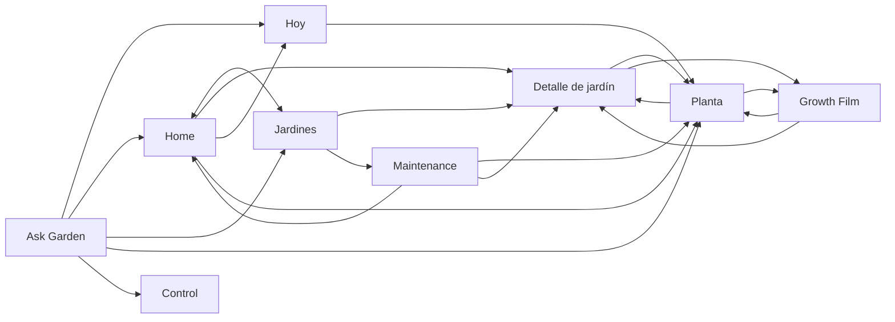

# Botanical Studio — preflight de Fase 04: Experience Consolidation

> Continuidad: 04.A cerrada en `78a8385`. Política actual y B1–B7 en
> [Fase 04.B](BOTANICAL_STUDIO_PHASE_04_B.md); las recomendaciones históricas de
> Astra obligatorio quedan superadas por la evaluación técnica aprobada.

Fecha: 13 de septiembre de 2026. Base: **`6cc1eba`**, rama `codex/botanical-plant-integration`. Tramo autorizado: **GPT-5.6 Sol High, mapeo y preparación exclusivamente**.

**Preflight terminado; consolidación todavía no iniciada.** No se modificaron componentes, estilos, rutas, datos, configuración AI, contratos ni infraestructura. Sin deploy, publicación o cambios remotos. Los archivos preexistentes `docs/VISUAL_DEPTH_STUDY.md` y `qa/depth-study*` permanecen fuera del alcance.

**Actualización posterior:** [Fase 04.A — baseline integrado y propietarios](BOTANICAL_STUDIO_PHASE_04_A.md) establece la evidencia sobre el producto completo y la siguiente parada, antes de 04.B. Este preflight conserva su plan histórico. En particular, 04.A confirma V02 por color/espaciado, pero descarta el padding como ejemplo demostrado en el sheet de Planta medido.

La dirección Botanical Studio / Living Botanical Cinema y las decisiones V1 están congeladas. La Fase 04 debe reparar continuidad y reducir inconsistencias conservando las composiciones aprobadas. No debe producir otro diseño conceptual ni sustituir formularios canónicos.

Referencias: [dirección 01](BOTANICAL_STUDIO_PHASE_01.md), [Maintenance 02.1](BOTANICAL_STUDIO_PHASE_02_1.md), [Growth Film 02.2](BOTANICAL_STUDIO_PHASE_02_2.md), [Planta 02.3](BOTANICAL_STUDIO_PHASE_02_3.md), [superficies 03](BOTANICAL_STUDIO_PHASE_03.md). Sus cierres locales se conservan; los pendientes autenticados/físicos no se cierran en este documento.

## 1. Mapa de superficies y flujos reales

| Superficie | Ruta / composición | Entradas y salidas principales | Datos y frontera semántica que se conserva |
| --- | --- | --- | --- |
| Home | `/`; `AppShell`, `collection-home` | Marca y navegación; jardines → detalle; novedades → ciclo/jardín; Atención → ciclo/jardín/Hoy; edición → Ajustes | Dashboard, frase y portadas elegidas; tres novedades. Conservar las llamadas de visita existentes, sin reinterpretar ocupación como salud. |
| Jardines | `/gardens`; `AppShell`, `collection-gardens` | Home; crear → nuevo jardín; iniciar/reanudar Maintenance; Control; detalle; Hoy | Snapshot por usuario, reconocimiento online, fallback local, sesión abierta y selección de jardines. Abrir o reanudar no crea otra sesión. |
| Detalle de jardín | `/garden/:gardenId`; shell y mapa/lista existentes | Colecciones → jardín → Planta desde mapa/fila; Film de jardín; compartir; editar sistema | Puente indispensable entre superficies aunque no fuera una de las cuatro de Fase 03. Mantener mapa físico V1, posición, ocupante y ciclos históricos. |
| Hoy | `/today`; `AppShell`, `today` | Navegación; seguimiento de jardín; pendiente → formulario inline o ciclo/jardín | Attention vigente; evaluación, acción, completar, posponer, descartar siguen siendo operaciones explícitas distintas. Ver la cola no completa nada. |
| Maintenance | `/maintenance/:sessionId`; shell operativo propio | Jardines → sesión; historia → Planta; pausa → Home; completar → primer jardín de la sesión | Sesión, posición/ciclo capturado y guardas de ocupante. Guardar conserva la posición. «Se ve bien» confirma una conclusión; «Siguiente planta» actualiza progreso de sesión sin crear un hecho de salud. |
| Planta | `/cycle/:cycleId`; `AppShell`, retrato y sheets | Jardín/pendientes/novedades/Maintenance → ciclo; breadcrumb → jardín; historial, fotos, compartir, Film | Observaciones, germinación, conteos, evaluaciones, intervenciones, incidencias, cosecha, traslado/intercambio, cierre/reemplazo/corrección, seguimientos, invalidación y provenance existentes. |
| Growth Film | `/cycle/:cycleId/film` o `/garden/:gardenId/film`; sala inmersiva propia | Planta/jardín → Film; volver → ciclo/jardín; fuentes → ciclo/fotos/Film histórico | Fotos reales, límites de ciclo, narrativa determinística y hitos confirmados. Selección cronológica, música, títulos y encuadre del mismo archivo renderizado que se exporta. Abrir no renderiza automáticamente ni crea hechos. |
| Ask Garden | `/ask-garden`; `AppShell`, `ask` | Navegación; respuesta → Hoy, Home, Jardines, Control o ciclo; nueva sesión local | Resolver determinístico y ruta AI actual. Interpreta/proporciona contexto; no modifica hechos canónicos. No habilitar Garden AI. |

Las flechas son destinos, no escrituras. Home/Jardines/Hoy/Ask se comunican además mediante la navegación común. Settings, Register, fotos, compartir y edición de sistema son fronteras adicionales de regresión, no nuevas superficies a rediseñar.

### Continuidad y efectos: contrato de presentación

| Intención | Efecto actual / regla para Fase 04 |
| --- | --- |
| Abrir ficha, Film, fuentes, sheet o formulario | Navegar/leer/mostrar propuesta. No convertir en confirmación. Mantener sincronización de borradores y efectos de visita que ya existan; «sin hechos nuevos» no equivale a «ninguna persistencia en todo el producto». |
| Maintenance: Siguiente planta | Progreso operativo mediante `markMaintenancePositionInspected`; no `visual_review` ni `health_confirmed`. En frontera estructural se conserva el progreso omitido del ciclo capturado. |
| Maintenance: Se ve bien | Confirmación explícita que usa la operación existente para registrar evaluación visual. No fusionar con Siguiente. |
| Guardar observación/hecho/seguimiento | Formulario y confirmación existentes; permanecer en esa posición hasta la decisión de avanzar. |
| Completar / posponer / descartar Attention | Operaciones y resultados diferentes. Una evaluación «Listo» no significa necesariamente intervención ejecutada. |
| AI / acción prellenada | Propuesta o formulario, nunca ejecución implícita. Cancelar no guarda un hecho. |
| Film: preparar / exportar | Render local y descarga; mismo plan y blob de preview/export, sin fotografías o eventos nuevos. |

## 2. Diagnóstico: qué está bien y qué necesita consolidación

La base ya posee identidad y capacidades reales: fotografía protagonista, jerarquía editorial, retrato aprobado, recorrido operativo y sala cinematográfica. Hay reutilización efectiva de `BotanicalGardenCard`, `DocumentaryPhoto`, `BotanicalSheet`, formularios de hechos y herramientas Attention. Las hojas botánicas usan diálogo nativo, foco inicial, contención de teclado, cierre protegido durante guardado y devolución de foco. Planta tiene navegación de tabs con teclado; Maintenance diferencia conclusión y progreso; Film separa catálogo, composición y recursos de render. **Estas fortalezas se conservan.**

El problema transversal es la convivencia de estilos históricos y nuevas capas, junto a adaptadores de navegación que todavía esperan markup anterior. No se justifica uniformar todas las pantallas: se necesita propiedad clara de tokens/controles, reparar conexiones reales y probarlas juntas.

### Inventario priorizado

P1 = corregir antes del cierre global. P2 = consolidar o decidir explícitamente después de asegurar regresión. F = frontera pendiente, no defecto visual demostrado.

| ID | Nivel / evidencia | Inconsistencia o duplicación | Intervención candidata y límite |
| --- | --- | --- | --- |
| N01 | P1 · código | `PlaceLink` espera identidad `profile` y `.botanical-portrait h1`; `PlantStudio` no emite esa identidad ni ese selector, y vuelve con `Link` ordinario. La ruta funciona, pero el adaptador de transición/foco/retorno ya no encuentra su destino. | Conectar identidad y foco al retrato actual, preservando exactamente su composición. Restaurar origen mapa/fila cuando exista; entrada directa sin origen inventado. |
| N02 | P1 · código | `PlaceLink.test.tsx` usa la antigua ficha como fixture; los harnesses reemplazan las otras superficies por destinos simulados. No prueban N01 ni la cadena completa. | Fixture de rutas/componentes actuales con CSS del producto completo. Ampliar prueba de transición, atrás, foco y navegación rápida. |
| V01 | P1 · navegador + código | Home emite `home-hero--photo`; el título/eyebrow se blanquean con `.bc-home-hero--photo`, que nunca coincide. A 390 px el título permanece `rgb(25,58,48)` sobre la portada oscurecida. | Reparar selector y comprobar portada oscura/clara/ausente/carga tardía sin cambiar diseño, encuadre o contenido. |
| V02 | P1 · código | `growth-film.css` contiene diez reglas globales `.record-detail` no limitadas a Film. Planta comparte la clase: sus reglas no redefinen todas las propiedades, por ejemplo el padding global de Film. Las rutas se importan estáticamente en `App`. | Acotar las reglas al sheet Film. Verificar producto con todas las hojas de estilo; el harness Planta no importa Film y no demuestra aislamiento global. |
| V03 | P1 · navegador + código | Ask combina móvil hasta 719 px en `styles.css` con corrección hasta 640 px en el scope nuevo. A 690×844: chat 696 px, padding inferior del main 142 px y documento 942 px; a 390×844: padding 0 y documento 844 px. | Definir un único propietario de altura/clearance para este intervalo. Preservar hilo interno y compositor; validar también alturas cortas y teclado. No afirmar que el compositor esté cubierto en esta muestra: quedó sobre la navegación. |
| A01 | P1 · código | Viewport del producto declara `maximum-scale=1.0,user-scalable=no`. Los harnesses usan otro viewport sin bloqueo. | Quitar bloqueo de zoom y probar reflow/texto ampliado. Es una corrección de accesibilidad, no un cambio de dirección. Safari físico sigue separado. |
| A02 | P1 · navegador + código | «Registrar» como enlace en Home mide 37 px de alto; fichas tienen acciones de 38/43 px y Film range de 30 px en CSS. La pauta aprobada pide objetivos táctiles ≥44 px. | Ampliar área interactiva sin alterar por defecto tipografía/composición. Medir caja y posibles hit areas reales, no sólo altura visual del texto. |
| A03 | P1 · código | Confirmación de salida con borradores usa `section role=dialog`, sin infraestructura de foco/trap/Escape/inert del diálogo nativo compartido. | Reutilizar infraestructura modal; conservar exportar/sincronizar/descartar, busy y privacidad. Probar con borradores simulados, sin cerrar una cuenta real. |
| A04 | P2 · navegador + código | Navs tienen nombres distintos, pero los enlaces activos no emiten `aria-current`. No hay política general de foco/scroll al cambiar de ruta; Maintenance sí aplica una propia. | Añadir estado accesible y reglas explícitas de llegada/retorno. No hacer scroll/foco general que compita con PlaceLink, tabs o sheets. |
| C01 | P2 · código | Paleta legacy en `:root`, paleta botánica scoped y siete `--bc-*` duplicados en dos bloques. Film redefine tokens para tema oscuro; shell Planta queda fuera del scope botánico del contenido. | Canonizar/aliasar valores y documentar tema claro/oscuro y shell contextual. No cambiar colores aprobados ni trasladar el tema Film al shell. |
| C02 | P2 · código | Ocho archivos, 2.220 líneas CSS; `styles.css` conserva múltiples pasadas, A/B y scopes de integración. `.ask-garden-suggestions` tiene `flex !important` y después `grid`; navegador confirma `flex`. | Inventario de propiedad por selector. Retirar sobrescrituras de forma incremental manteniendo resultado aprobado. No borrar pases completos: jardín/mapa/fotos y otras rutas todavía dependen de ellos. |
| C03 | P2 · código | Foco global dorado, botánico verde, Hoy/Ask ámbar y variaciones Film; medidas/radios de botones y estados repartidos entre scopes. | Tokens de foco/target/feedback y variantes por intención/contexto. Preservar pills de Planta y tema cinematográfico: igual función no obliga a idéntica silueta en todos los contextos. |
| C04 | P2 · código | `AttentionList` se exporta desde `GardensPage` y lo consumen Home/Hoy; render de novedades propio en Home y Jardines; modales de formulario, evidencia y salida tienen implementaciones distintas. | Extraer sólo piezas compartidas demostradas. Conservar Home con tres novedades y Jardines con fechas; visor original sigue siendo visor, no sheet de formulario. |
| C05 | P2 · código | Dos imports Google Fonts con configuraciones distintas; componentes/exportadores antiguos y selectores `growth-film-*` conviven con la implementación actual. | Auditar dependencias, uso y requests antes de deduplicar. No cambiar fuentes ni eliminar código por nombre/antigüedad. Optimización de bundle queda separada. |
| N03 | P2 · código / continuidad por validar | Desde Maintenance se puede ir al ciclo; ficha vuelve al jardín y no al recorrido de origen. Completar una sesión multijardín vuelve al primer jardín. | Definir continuidad contextual sin cambiar identidad de sesión ni guardas. Probar regreso por browser/back/reanudar y borrador no guardado; no afirmar pérdida de datos demostrada. |
| S01 | P2 · código | Respuesta determinística de Ask habla de «hoy» pero usa Attention completa; listas de germinación pueden repetir números de posición sin jardín. Pod/Posición y etiquetas de evaluación varían. | Acordar copy/contexto preciso con datos disponibles. No modificar filtros, resolver, propósitos o persistencia bajo un refactor visual. Mantener evaluación separada de acción realizada. |
| S02 | P2 · código | Botón de vuelta de Maintenance conserva `aria-label="Pausar revisión"` incluso si sesión cerrada navega a Home. | Etiqueta según estado, sin alterar destinos ni operaciones. |
| F01 | F · código | Nueva sesión Ask no aborta consulta en curso ni limpia error de request; es límite ya documentado en Fase 03. | Probar respuesta tardía/error y acordar contrato antes de tocarlo. No activar AI para la prueba: usar fixtures. |
| F02 | F · código | Home espera `getGardenCoverPhotos` de cada jardín aunque no usa el resultado; un fallo bloquea dashboard/portada. | Dependencia de carga/performance preexistente. Separar diagnóstico de cambio funcional: no retirar lecturas como supuesta limpieza CSS. |
| F03 | F · código / dispositivo | Clearance de shell + main se acumula; navegación inferior legacy no añade safe-area propia; PWA update se monta en shell/Maintenance, no Film. `overflow-x:clip` puede ocultar recorte. | Medir elementos visibles además de scrollWidth. Probar banner, teclado, orientación y safe area; no añadir chrome a Film por uniformidad. |

Ninguna inspección de este tramo demuestra un nuevo fallo de servidor, una escritura canónica automática de AI o un error físico de fullscreen. Esos temas conservan su frontera de prueba.

### Diferencias intencionales que no se deben borrar

- Shell general con navegación vs Maintenance con contexto/progreso vs Film inmersivo: tres contextos legítimos, no tres productos distintos.
- Claro editorial vs oscuro cinematográfico; retrato documental, tarjetas de colección y preview contenido conservan encuadres propios.
- Formulario inline de Hoy vs sheet contextual de Planta/Maintenance: ubicación diferente sobre los mismos contratos.
- «Se ve bien», «Siguiente planta», «Omitir», evaluación, intervención y seguimiento son intenciones diferentes.
- Registrar en ficha abre su sheet; fuera de ficha va a `/register`. Historial, fuentes y AI conservan sus rutas existentes.
- Nombre común y línea inglés/científico permanecen en el bloque aprobado. No inferir especies o identidad botánica faltante.

## 3. Componentes y tokens candidatos

| Candidato | Reutilizar / consolidar | Resguardo |
| --- | --- | --- |
| Base `botanical.css` | Un dueño de papel/superficie/tinta/línea/bosque/salvia; alias legacy/bc durante migración; tokens de feedback, foco, espacio y clearance | Mismos valores aprobados; theme Film explícito. No renombrado masivo inicial. |
| BotanicalButton y controles | Primary/secondary/text/icon; tamaño táctil, loading/disabled, focus-visible | Conservar `button` vs `Link`, tipo submit, busy y variantes contextuales. No mezclar operación con navegación. |
| BotanicalSheet | Ciclo de vida modal, busy, Escape/backdrop, scroll, header/footer, restauración de foco | Visor de evidencia puede compartir infraestructura sin adoptar composición de formulario. Evitar nuevos wrappers de datos. |
| AppShell / navegación contextual | Nav accessible, llegada/retorno, clearance y notices | No imponer shell a Maintenance/Film ni cambiar mapa/rutas V1. |
| PlaceLink / identidad | Adapter sobre markup vigente, origen efímero y fallback sin movimiento | No animar fotos ambientales ni fabricar origen para entradas directas. |
| AttentionList / fila / feedback | Compacto navegable y gestionado; estados y etiquetas compartidos | Formularios/semántica/idempotencia existentes; no nueva proyección Attention. |
| StatePanel y mensajes | Loading/error/empty/retry/busy coherentes; theme y anuncio accesible | Vacío de cola ≠ afirmación de salud. Error de recarga puede coexistir con datos previos. |
| Fotografía | DocumentaryPhoto, GardenCoverImage y presentación de evidencia | Mantener consumidor/rendition, original, captura, portadas y URL firmada; no unificar contratos de medios distintos. |
| Formularios reales | Chrome de labels/ayudas/campos/acciones aplicado a Observation/Fact/Attention/CycleActions | No reemplazar capacidades por formularios simplificados; mantener validación, campos, tipos y confirmaciones. |
| Film composition/session | Contrato común preview/export ya logrado, pruebas de regresión | No tocar renderer, narrativa o selección para limpiar CSS. |

## 4. Riesgos y dependencias

1. **Cascade global real vs fixture aislado.** Importar una ruta importa también su CSS. Acotar V02 antes de reducir overrides; probar entrada directa y viaje completo con la misma entrada CSS del producto. No asumir orden por lista de archivos: confirmar resultado del bundle.
2. **Foco/scroll con varios propietarios.** Route policy, PlaceLink, tabs, sheets y Maintenance no pueden competir. N01 necesita adaptar el contrato de presentación, no nueva arquitectura de navegación.
3. **Dominio detrás de superficies ligeras.** Extraer botones/feedback no debe cambiar request IDs, busy, guards de ciclo capturado, resultados Attention, borradores, invalidación o provenance.
4. **Rutas puente legacy.** GardenPage/mapa, Control, Register, Settings, fotos/share/system requieren smoke de regresión aunque no se extienda su diseño. Borrar visual-pass A/B sin cobertura sería arriesgado.
5. **Browser sintético vs autenticado/físico.** Harnesses no validan visitas remotas, persistencia, RLS/Storage, captura ni fullscreen Safari. La diferencia de viewport demuestra que un harness aprobado no basta para accesibilidad de la entrada real.
6. **Film y recursos.** Mantener aborto/disposal al salir, revocación de URLs de blob y separación de música de clip/diario. Preview/export debe conservar título, encuadre, selección, orden, música y narrativa.
7. **Límites de carga/conversación.** F01/F02 requieren decisión funcional específica si se intervienen; no corregirlos silenciosamente como presentación.
8. **Rendimiento histórico.** Avisos de chunk >500 kB/import dinámico inefectivo ya constan en cierres anteriores. No abrir code-splitting/arquitectura para este preflight ni prometer eliminación de esos avisos por consolidar estilos.

No se detectó razón para reabrir contratos backend, activar AI, cambiar mapa V1 o iniciar migraciones.

## 5. Secuencia recomendada de intervención

Cada bloque termina con diff acotado, evidencia y commit local; ninguna escritura remota queda implícitamente autorizada.

| Bloque | Trabajo y entregable | Criterio de salida |
| --- | --- | --- |
| 04.A · base de verificación | Inventario selector → propietario; fixture integrado de rutas reales/entrada CSS; snapshots del estado aprobado y checks de llamadas | Reproducir N01, V01/V02/V03, estados con datos abundantes y fronteras. Baseline sin usar servicios reales. |
| 04.B · correcciones de continuidad y accesibilidad | PlaceLink/Planta actual, zoom, nav estado/foco, salida modal, targets y clearance | Navegación y retorno correctos; composición idéntica salvo defectos identificados; sin hechos implícitos. |
| 04.C · propiedad visual | Selector Home y scope Film; tokens/aliases; foco/feedback/controles; retirar overrides redundantes por área | Una propiedad clara por regla; sin cambios de paleta/jerarquía/encuadre. QA por superficie y rutas puente. |
| 04.D · chrome/formularios/estados | Reutilización mínima de filas y chrome; densidad móvil y estados empty/error/loading/busy | Capacidad canónica completa, foco estable, cancelación sin guardar, acciones fuera de overlays. |
| 04.E · revisión global | Cadena completa, breakpoint seams, texto ampliado, preferencias, regresiones de Fases 02–03 y suite/build/lint | Informe global con evidencia local y pendientes autenticados/físicos separados. Sin deploy. |

N03/S01/F01/F02 necesitan contrato específico antes de cambiar comportamiento/copy del resolver o lecturas. Pueden documentarse como pendientes aceptados si quedan fuera; no bloquear toda la limpieza visual ni ejecutarse por inercia.

## 6. Archivos previsiblemente afectados

No todos deben cambiar: lista de impacto para planificar diffs, no autorización para reescribirlos.

| Grupo | Archivos |
| --- | --- |
| Entrada y cascade | `index.html`, `src/main.tsx`, `src/styles.css`, `src/visual-pass-a.css`, `src/visual-pass-b.css` |
| Compartidos | `src/components/AppShell.tsx`, `PlaceLink.tsx`, `PlaceIdentity.tsx`, `StatePanel.tsx`, `PwaUpdateNotice.tsx`, `botanical/BotanicalControls.tsx`, `botanical/botanical.css` y sus pruebas |
| Colecciones y puente | `src/features/gardens/HomePage.tsx`, `GardensPage.tsx`, `BotanicalGardenCard.tsx`, `GardenCover.tsx`, `GardenPage.tsx`, `PhysicalMap.tsx`, `surfaces-botanical.css` |
| Operativos | `src/features/gardens/TodayPage.tsx`, `AttentionTaskTools.tsx`, `MaintenancePage.tsx`, `MaintenancePositionActions.tsx`, `MaintenancePortrait.tsx`, `maintenance-botanical.css` |
| Planta | `src/features/cycles/PlantStudio.tsx`, `PlantHistory.tsx`, `PlantRecordSheet.tsx`, `plant-botanical.css`, `DocumentaryPhoto.tsx` |
| Film | `src/features/cycles/growth-film.css`, `GrowthFilmPage.tsx`, `GrowthFilmStudio.tsx`; composición/session/renderer sólo para regresión salvo defecto nuevo |
| Conversación | `src/features/gardens/AskGardenPage.tsx`; `src/domain/ask-garden.ts` únicamente si se aprueba una corrección concreta de resolver, no para CSS |
| QA/documentación | `qa/surfaces-integration/*`, `qa/maintenance-integration/*`, `qa/plant-integration/*`, `qa/growth-film-integration/*`; fixture integrado nuevo; pruebas existentes y guía de cierre 04 |

`src/lib/garden-api.ts`, esquema/migraciones, gateway AI y contratos domain no son candidatos a refactor en este plan. Se observan llamadas con mocks para preservar comportamiento. Si surge un defecto real en esa frontera, detenerse y delimitarlo.

## 7. Matriz de QA para Fase 04

**Plan, no resultados de ejecución de Fase 04.** L = local/fixture integrado; A = autenticada; F = dispositivo físico. Las filas A/F permanecen pendientes hasta su evidencia propia.

| ID | Ámbito | Escenario / prueba | Resultado exigido |
| --- | --- | --- | --- |
| Q01 | L | Home → Jardines → jardín/mapa o fila → Planta → atrás; repetir con scroll y navegación rápida | Identidad actual, heading foco, retorno al origen; sin clones/observer residuales. |
| Q02 | L | Entrada directa/cambio de ciclo, atrás/adelante y movimiento reducido | Sin origen inventado, datos obsoletos o scroll/foco concurrente; URL/guardas intactas. |
| Q03 | L | Jardines → Maintenance → guardar observación/hecho/seguimiento → registrar otro → Siguiente | Quedarse tras guardar; progreso de sesión sólo al avanzar; ninguna evaluación de salud implícita. |
| Q04 | L | Se ve bien, Omitir, pausa/reanudar, sesión cerrada, finalizar multijardín; ida a historial | Operación correcta, retorno documentado, label según estado, sesión preservada. |
| Q05 | L | Hoy: propósitos reales, Listo/Todavía no/No requerido/No determinado, acción, completar/posponer/descartar | Formularios y llamadas existentes; cancelación sin guardar; cola y etiqueta temporal coherentes. |
| Q06 | L | Planta: todos los tipos de registro y operaciones, ciclo cerrado, intercambio ocupado, invalidez/occupant cambiado | Capacidades existentes accesibles; ningún control canónico desaparece; IDs y provenance conservados. |
| Q07 | L | AI propuesta/hash/state → formulario sin recargar → cancelar; navegación a otro ciclo | Apertura inmediata, intención consumida una vez; ninguna llamada de hecho antes de confirmar. AI fixture exclusivamente. |
| Q08 | L | Ask determinístico, largo, fuentes ausentes, loading/error, corrección verbal, nueva sesión/request tardío | Resolver/ruta conservados; interpretación sin writes; límite tardío definido explícitamente. |
| Q09 | L | Planta/jardín → Film → fuentes/preview/selección/música → volver; salir durante render | Orden y plan estables, recursos liberados; no render ni hechos automáticos al abrir. |
| Q10 | L | Video renderizado y archivo exportado | Mismo blob/plan; títulos, encuadre, momentos, música, orden, narrativa coinciden; sin nuevas fotos/eventos. |
| Q11 | L | 320/390/820/1440 px en las siete superficies, mapa puente y sheets/formularios | Contenido y objetivos íntegros, sin overflow/recorte no intencional; screenshot inspeccionado por estado. |
| Q12 | L | Bordes 619/620, 640/641, 699/700, 719/720, 819/820; 690×844 y desktop 1280×720 | Sin salto de propietarios de scroll/clearance, compositor y confirmaciones descubiertos. |
| Q13 | L | Zoom 200%, texto largo/ampliado, nombres sin identidad confirmada, muchos jardines/eventos/pendientes | Zoom permitido; reflow sin truncar campos/acciones; nombre común + inglés/científico en bloque aprobado. |
| Q14 | L | Tab/ShiftTab, tabs de Planta, Escape, cierre/backdrop/busy, modal sobre evidencia, salida con borradores | Foco visible/contención/devolución; fondo no interactivo; ninguna salida destructiva accidental. |
| Q15 | L | Medir targets de links/buttons/range y active nav; axe + contraste manual sobre fotos/tema oscuro | Hit areas ≥44 px, estado accesible, contraste revisado donde gradientes requieren juicio visual. |
| Q16 | L | Empty/error/retry/slow media/broken image/offline/busy/PWA update en contextos con aviso | Estados claros sin afirmación de salud; último contenido válido y recuperación según contratos existentes; overlays no cubren acciones. |
| Q17 | L | Misma entrada CSS del producto; abrir detalles Planta después/antes de Film | Ninguna regla de Film afecta Planta; token/foco/espaciado estable por tema, sin depender del orden de navegación. |
| Q18 | L | Reduced motion/transparency, más contraste y scroll JS | Preferencias respetadas sin eliminar jerarquía, foco o affordances. |
| Q19 | L | Smoke Control/Settings/Register/fotos/share/system, mapa/ciclos históricos y borradores | Ninguna regresión al retirar legacy; contratos y navegación V1 conservados. |
| Q20 | L | Tests apropiados + suite final, lint, typecheck/build producto y harnesses | Resultados nuevos documentados; distinguir avisos históricos de fallos nuevos; no sustituir QA visual con build. |
| Q21 | A · pendiente | Planta: medios/originales/portadas reales, ciclos/correcciones/acciones, recarga/provenance | Persistencia y acceso real verificados sin confundirlos con mocks. Ver cierre 02.3. |
| Q22 | A/F · pendiente | Film con fotos reales y pistas; exportación real, fullscreen nativo Safari iPhone | Verificar en dispositivo inicio/salida/orientación, audio, preview/archivo final. Ver cierre 02.2. |
| Q23 | A/F · pendiente | Fase 03: visitas/snapshot, Attention, acciones/recarga, conteos antes/después de Ask | Semántica/persistencia reales; separación de datos canónicos y conversación. Ver cierre 03. |
| Q24 | F · pendiente | iPhone Safari: home indicator/notch, teclado abierto/cerrado, landscape, zoom, sheets y navegación | Safe areas reales, botón de guardar/compositor visibles, sin scroll accidental del fondo. |
| Q25 | A · pendiente | Maintenance: sesión real, guardas de ciclo/ocupante, progreso vs salud, reintento y continuación | Progreso real sin conclusión implícita; registros únicos después de confirmar. Ver cierre 02.1. |

### Evidencia puntual del preflight (13 de septiembre)

Se ejecutó el harness existente `qa/surfaces-integration` en Chromium local sobre `127.0.0.1:4198`, usando agent-browser. Fotos/respuestas sintéticas, sin cuenta, Garden AI o Supabase. Se cerraron navegador y servidor al terminar.

| Observación | Resultado / evidencia local |
| --- | --- |
| Home con portada a 390×844 | V01 confirmado: clase `home-hero bc-home-hero home-hero--photo`, título `rgb(25,58,48)`. Captura inspeccionada: `artifacts/phase04-preflight/home-390.png`. |
| Registrar Home | Caja de enlace 37 px de alto; cero atributos `aria-current` en enlaces de navegación. |
| Ask a 690×844 | V03 confirmado: documento 942 px; chat 696 px; main padding-bottom 142 px; compositor bottom 742,17 y nav top 774 (no colisión en esta muestra). Captura inspeccionada: `artifacts/phase04-preflight/ask-690.png`. |
| Ask a 390×844 | Documento 844 px; chat 696 px; main padding-bottom 0; compositor bottom 760 y nav top 774. Captura: `artifacts/phase04-preflight/ask-390.png`. |
| Sugerencias Ask | `display:flex` computado; conflicto con regla posterior `grid` sigue activo. |
| Errores de navegador | Sin errores registrados en estas observaciones puntuales. |

Artefactos locales ignorados por Git; no son un preview publicado. No se repitió la suite/build de Fase 03: este tramo sólo añade documentación. Los resultados 33 archivos/187 pruebas, lint y build aprobados de `6cc1eba` son **baseline histórico**, no una ejecución nueva de preflight ni QA global. Validación documental: `git diff --check` y enlaces relativos.

## 8. Modelo y parada natural

**Mantener GPT-6 Astra xhigh para ejecutar el primer bloque sistémico de consolidación y para la revisión global final de Fase 04.** No recomiendo bajar esa referencia después del mapa.

Evidencia concreta: N01 cruza un adaptador probado con markup ya sustituido; V02 puede pasar QA de superficie y fallar con cascade global; V03 cruza dos dueños responsive; A01 evidencia divergencia entre entrypoint real y harness. Resolverlos junto con tokens, foco/retorno y semántica de progreso requiere evaluar efectos combinados sobre siete superficies y rutas puente. La complejidad es de integración transversal y cobertura, no una nueva arquitectura, datos o generación AI.

Sol High fue adecuado para este mapa y sigue siendo candidato para implementación funcional **acotada después de que Astra cierre propietarios, invariantes y lista concreta de diffs**. Terra High puede ejecutar un tramo mecánico CSS/QA por superficie cuando ya no queden decisiones sistémicas. Eso no rebaja la revisión final Astra xhigh ni autoriza cambios de modelo automáticos.

Siguiente paso propuesto: **04.A con Astra xhigh** — fijar baseline integrado, propietarios de cascade/foco/scroll y límites de cada corrección; continuar con 04.B sólo dentro de ese alcance. Detenerse al cerrar el bloque sistémico si el siguiente tramo puede resolverse con Sol/Terra, o ante una complejidad nueva que requiera elevar nivel. Explicar evidencia y esperar ajuste del usuario.

**Parada actual: no empezar Fase 04 ni modificar la experiencia global hasta confirmación del usuario.** QA autenticada/física de Growth Film, Planta y Fase 03 permanece separada y pendiente.

## Continuidad aprobada tras 04.A

La evaluación técnica y ejecución acotada de B1–B7 se documentan en
[BOTANICAL_STUDIO_PHASE_04_B.md](BOTANICAL_STUDIO_PHASE_04_B.md).
La política actual reemplaza Astra xhigh obligatorio: B Sol High; C/D Terra High
según alcance real; E Sol High. Subidas requieren evidencia concreta y parada previa.
Cadence aprobada: B commit local; evaluar push/preview acumulados tras C; D sin
deploy automático; E cierre/push candidato. No se publica en B.
